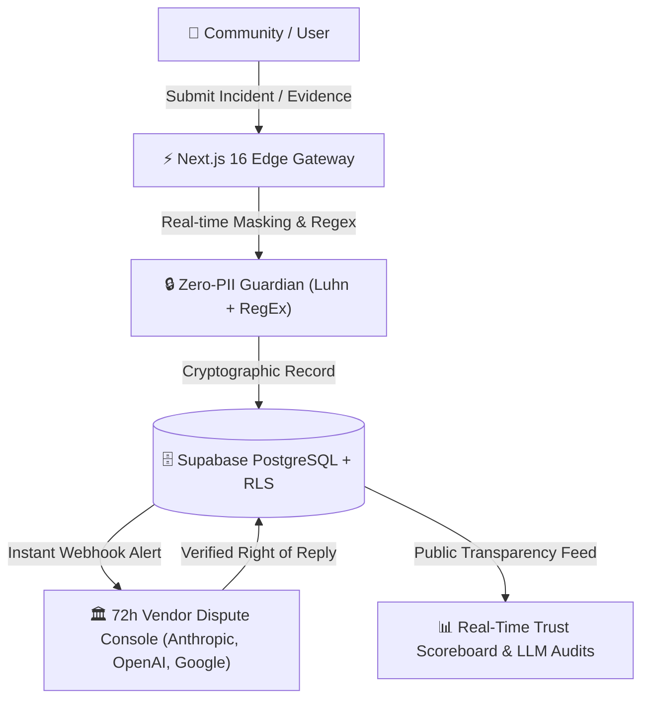

<div align="center">

# 🛡️ ALPAR AI

### The Sovereign Trust & Accountability Infrastructure for Autonomous Artificial Intelligence
**Independent Public Incident Registry • Zero-PII Guardian • 72h Vendor Dispute Console**

[](https://alparai.com)
[](./LICENSE)
[](https://eur-lex.europa.eu/eli/reg/2024/1689/oj)

<br/>

[](https://github.com/quantummatrixcore-lab/alparai/actions/workflows/ci.yml)
[](https://nextjs.org/)
[](https://react.dev/)
[](https://www.typescriptlang.org/)
[](https://tailwindcss.com/)
[](https://supabase.com/)
[](https://github.com/quantummatrixcore-lab/alparai)

</div>

---

## 🌍 The Mission: Why ALPAR AI?

Artificial intelligence is rapidly transitioning from passive chat interfaces to **autonomous agents** that execute financial transactions, summarize medical data, render legal opinions, and autonomously manipulate production databases.

When an AI system causes real-world harm—such as a catastrophic hallucination in financial modeling, biased discriminatory scoring, unauthorized PII exfiltration, or autonomous agent escape—the public record is fragmented across Twitter/X threads, Discord channels, and Reddit forums.

**ALPAR AI fixes the accountability crisis.**

We provide the independent, tamper-proof, community-driven audit and reporting layer for artificial intelligence systems worldwide. 

> **Community Reports. AI Model Makers Respond. The Public Decides.**

---

## 🏛️ The 4 Sovereign Pillars



### 1. 🚨 Autonomous Incident Registry
A tamper-proof, public registry documenting real-world AI failures across LLMs, Multimodal models, and Autonomous Agents. Every submission undergoes structured categorization: Hallucination, PII Exfiltration, Algorithmic Bias, Autonomous Drift, Copyright Breach, and Prompt Injection.

### 2. 🔒 Zero-PII Guardian
To prevent the platform from becoming a vector for dox attacks or privacy leaks, all user-submitted prompts and screenshots pass through server-side PII scrubbing using the Luhn algorithm and strict regex masks (masking credit cards, phone numbers, Turkish TC IDs, IBANs, API keys, and personal email addresses).

### 3. ⏱️ 72h Vendor Dispute Console
Model creators (OpenAI, Anthropic, Google, Mistral, and local frontier labs) receive immediate notification and an SLA-backed 72-hour window to submit an official counter-analysis or mitigation patch, preserving objective fairness.

### 4. ⚖️ EU AI Act & KVKK Compliance Shield
Direct technical alignment with **EU Regulation 2024/1689 (Articles 74, 85, and 90)** and Turkish KVKK requirements. Provides pre-built incident reporting templates that satisfy regulatory auditing mandates before monetary penalties take effect in August 2026.

---

## ⚡ Technical Stack & Architecture

| Layer | Technology | Rationale |
| :--- | :--- | :--- |
| **Framework** | **Next.js 16.2 (App Router)** | React 19 Server Components, Server Actions, zero-waterfall data fetching. |
| **Styling** | **Tailwind CSS v4** | CSS-first `@theme` configuration, zero-runtime overhead, sub-millisecond hydration. |
| **Database & Auth** | **Supabase PostgreSQL** | Strict Row Level Security (RLS), Google OAuth, Frankfurt EU Data Center. |
| **Internationalization** | **next-intl (Bilingual)** | Native bi-directional localization (`/en`, `/tr`) with zero layout shift. |
| **Rate Limiting** | **Upstash Redis (Serverless)** | Token-bucket sliding window algorithm protecting against Sybil and DoS attacks. |
| **Monitoring** | **Sentry EU** | Real-time telemetry, Core Web Vitals profiling, and zero-leak error boundaries. |
| **Security Headers** | **Strict CSP + HSTS** | Frame-ancestors `none`, X-Content-Type-Options `nosniff`, Strict Referrer. |

---

## 🚀 Quickstart for Developers

### Prerequisites
* **Node.js**: `>= 20.0.0`
* **Package Manager**: `pnpm >= 9.12.0`

### Installation

```bash
# 1. Clone the repository
git clone https://github.com/quantummatrixcore-lab/alparai.git
cd alparai

# 2. Install dependencies
pnpm install

# 3. Configure environment variables
cp .env.example .env.local

# 4. Launch development server
pnpm dev
```

Visit [http://localhost:3000](http://localhost:3000) to view the application.

---

## 🛡️ Clean-Room Open Source Boundary

ALPAR AI follows an **Open Core (AGPL-3.0)** architecture. We maintain complete transparency regarding what is public and what remains managed:

| Component | License | Details |
| :--- | :--- | :--- |
| **Incident Registry Frontend** | **AGPL-3.0 (Public)** | 100% open source. Anyone can audit, run, and contribute. |
| **PII Guardian & Anonymizer** | **AGPL-3.0 (Public)** | Open regex and Luhn validation schemas. |
| **Data Schemas & Validations** | **AGPL-3.0 (Public)** | Supabase migrations and Zod validation contracts. |
| **Vendor Dispute Console** | **Managed B2B** | Closed-loop enterprise arbitration and SLA dispatch network. |
| **Underwriting API** | **Commercial API** | InsurTech risk-scoring feeds for enterprise AI policy underwriting. |

---

## 🤝 Contributing

We welcome contributions from AI safety researchers, legal scholars, developers, and designers.

1. Review [CONTRIBUTING.md](./CONTRIBUTING.md) for contribution guidelines and development workflow.
2. Read [CODE_OF_CONDUCT.md](./CODE_OF_CONDUCT.md) to maintain our respectful, evidence-based standard.
3. Submit an issue using our [GitHub Issue Templates](https://github.com/quantummatrixcore-lab/alparai/issues/new/choose).

---

## 🔒 Security & Vulnerability Disclosure

For security audits or responsible disclosure, please review [SECURITY.md](./SECURITY.md).  
To report urgent security or ethics breaches confidentially:
* 🛡️ **Whistleblower Desk:** [ihbar@alparai.com](mailto:ihbar@alparai.com)
* 📧 **General Security:** [security@alparai.com](mailto:security@alparai.com)

---

## 📜 Legal & Regulatory Notice

ALPAR AI operates as an **independent hosting intermediary** under:
* **EU E-Commerce Directive (2000/31/EC)**, Article 14
* **EU Digital Services Act (Regulation 2022/2065)**
* **Turkish Law No. 6563** (Regulation of Electronic Commerce)
* **GDPR & 6698 Sayılı KVKK**

Submissions are reviewed via automated PII filters and post-publication notice-and-takedown procedures. AI system owners have a guaranteed right of reply.

---

<div align="center">

**Crafted with conviction for the Autonomous AI Era.**  
[Website](https://alparai.com) • [GitHub](https://github.com/quantummatrixcore-lab/alparai) • [Contact](mailto:hello@alparai.com)

</div>
